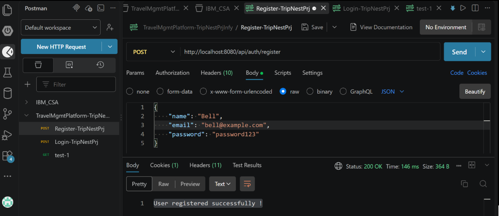
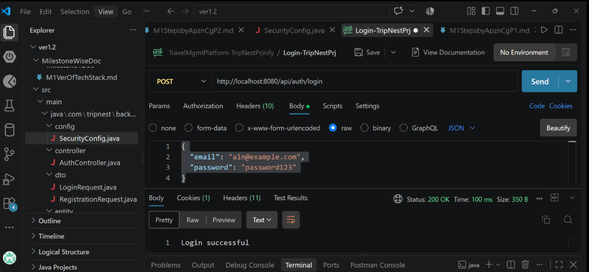
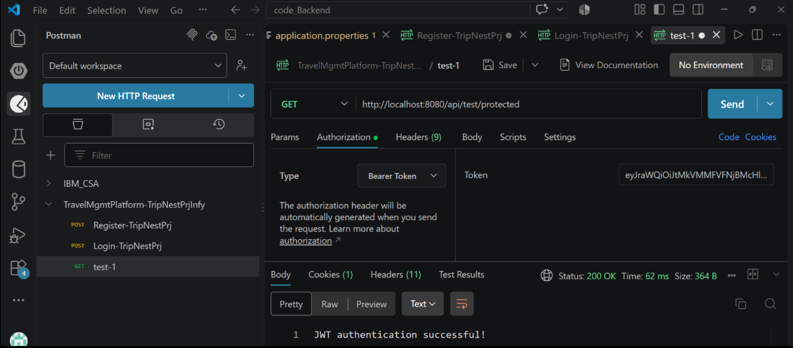

# TripNest — Backend M1

## 1. Project Overview

TripNest is a Travel Planning & Trip Management Platform.

This repository contains the **Spring Boot backend** for the TripNest project.

### Current M1 Backend Progress

The following backend foundation and JWT authentication flow have been implemented:

* Spring Boot backend setup
* PostgreSQL database connection
* JPA/Hibernate configuration
* User, Role and User-Role entities
* User registration
* BCrypt password hashing
* Login
* JWT generation
* JWT validation
* Protected API endpoint
* Spring Security configuration

> **RBAC and OAuth2 are separate tasks and are not included in the current implementation checkpoint.**

---

# 2. Technology Stack

| Technology                  | Purpose                       |
| --------------------------- | ----------------------------- |
| Java 21                     | Programming language          |
| Spring Boot 4.1.1           | Backend framework             |
| Spring Web MVC              | REST APIs                     |
| Spring Data JPA             | Database access               |
| Hibernate                   | ORM                           |
| Spring Security             | Authentication & API security |
| Spring Security OAuth2 JOSE | JWT support                   |
| PostgreSQL 17.11            | Database                      |
| Maven                       | Build/dependency management   |
| Lombok                      | Reduces boilerplate code      |
| Postman                     | API testing                   |

---

# 3. Backend Project Structure

Current important structure:

```text
code_Backend/
│
├── src/
│   └── main/
│       ├── java/
│       │   └── com/
│       │       └── tripnest/
│       │           └── backend/
│       │               ├── config/
│       │               │   ├── JwtConfig.java
│       │               │   └── SecurityConfig.java
│       │               │
│       │               ├── controller/
│       │               │   ├── AuthController.java
│       │               │   └── TestController.java
│       │               │
│       │               ├── dto/
│       │               │   └── RegistrationRequest.java
│       │               │
│       │               ├── entity/
│       │               │   ├── User.java
│       │               │   ├── Role.java
│       │               │   └── UserRole.java
│       │               │
│       │               ├── repository/
│       │               │   ├── UserRepository.java
│       │               │   ├── RoleRepository.java
│       │               │   └── UserRoleRepository.java
│       │               │
│       │               └── service/
│       │                   ├── AuthService.java
│       │                   └── JwtService.java
│       │
│       └── resources/
│           └── application.properties
│
└── pom.xml
```

> The exact package/class structure may change as the project develops.

---

# 4. Database

## Database

PostgreSQL is being used for the TripNest backend.

```text
Database: tripnest_db
Schema: public
```

The backend is successfully connected to:

```text
jdbc:postgresql://localhost:5432/tripnest_db
```

PostgreSQL connection has been verified through Spring Boot/Hibernate.

---

# 5. Database Tables

The current authentication-related schema contains three tables:

```text
users
roles
user_roles
```

## users

Stores registered users.

Important fields:

```text
id
email
name
password
```

* `id` → Primary Key
* `email` → Unique
* `password` → BCrypt hash, not plain text

Example:

```text
id | email              | name | password
---+--------------------+------+-------------------
1  | john@example.com   | John | BCrypt hash
```

---

## roles

Stores application roles.

Current roles:

```text
1 → TRAVELER
2 → GROUP_ADMIN
3 → ADMIN
```

The role table is prepared for the project's authorization requirements.

---

## user_roles

Connects users with roles.

Structure:

```text
id
user_id
role_id
```

Relationships:

```text
users 1 ──────── * user_roles * ──────── 1 roles
```

This allows a user to be associated with one or more roles.

Example:

```text
user_id = 2
role_id = 1

→ User 2 has TRAVELER role
```

---

# 6. Entity Layer

The backend uses JPA entities to map Java objects to PostgreSQL tables.

### User

Represents a registered TripNest user.

Mapped to:

```text
users
```

### Role

Represents an application role.

Mapped to:

```text
roles
```

### UserRole

Represents the relationship between a user and a role.

Mapped to:

```text
user_roles
```

---

# 7. Registration Flow

Registration endpoint:

```http
POST /api/auth/register
```

Example request:

```json
{
  "name": "John",
  "email": "john@example.com",
  "password": "password123"
}
```

High-level flow:

```text
Client
  ↓
AuthController
  ↓
RegistrationRequest DTO
  ↓
Validation
  ↓
AuthService
  ↓
BCrypt password hashing
  ↓
User entity
  ↓
PostgreSQL
```

The password is **not stored as plain text**.

Example database value:

```text
$2a$10$...
```

---

# 8. BCrypt Password Hashing

BCrypt is a one-way password hashing algorithm.

Conceptually:

```text
Plain password
      ↓
    BCrypt
      ↓
Password hash
      ↓
PostgreSQL
```

During login, Spring Security/BCrypt verifies whether the entered password matches the stored hash.

The original password is not recovered from the database.

---

# 9. Login Flow

Login endpoint:

```http
POST /api/auth/login
```

Example:

```json
{
  "email": "aln@example.com",
  "password": "password123"
}
```

Flow:

```text
Client
  ↓
AuthController
  ↓
AuthService
  ↓
Find user by email
  ↓
BCrypt password verification
  ↓
Password correct?
  ↓
JwtService
  ↓
JWT generated
  ↓
JWT returned to client
```

---

# 10. JWT Authentication

JWT stands for **JSON Web Token**.

The current implementation uses JWT with:

```text
HS256
```

JWT contains three logical sections:

```text
HEADER.PAYLOAD.SIGNATURE
```

Current payload contains:

```text
sub → user's email
iat → issued-at time
exp → expiration time
```

Example conceptually:

```json
{
  "sub": "aln@example.com",
  "iat": "...",
  "exp": "..."
}
```

The JWT is signed using the configured secret key.

---

# 11. JWT Configuration

JWT configuration is located in:

```text
JwtConfig.java
```

It provides:

```text
JwtEncoder
JwtDecoder
```

Conceptually:

```text
Secret Key
   │
   ├──→ JwtEncoder → creates/signs JWT
   │
   └──→ JwtDecoder → validates JWT
```

The JWT secret is configured through:

```properties
jwt.secret=...
```

### Security Note

A real production secret should **not be committed to GitHub**.

For deployment, the secret should be provided through environment variables or the deployment platform's secret-management mechanism.

---

# 12. JwtService

`JwtService` is responsible for JWT-related application logic.

Current responsibility:

```text
generateToken(email)
```

The token contains:

```text
subject
issued time
expiration time
```

Current token expiration:

```text
1 hour
```

---

# 13. Spring Security

Spring Security protects API endpoints.

Authentication endpoints are public:

```text
/api/auth/**
```

Other endpoints require authentication.

Conceptually:

```text
/api/auth/register
        ↓
     PUBLIC

/api/auth/login
        ↓
     PUBLIC

/api/test/protected
        ↓
 AUTHENTICATION REQUIRED
```

---

# 14. Protected Endpoint

A temporary endpoint has been created for JWT testing:

```http
GET /api/test/protected
```

Without a JWT:

```text
401 Unauthorized
```

With a valid JWT:

```http
Authorization: Bearer <JWT>
```

Response:

```text
JWT authentication successful!
```

This confirms that JWT generation and JWT validation are working.

---

# 15. JWT Authentication Flow

Complete current flow:

```text
                 REGISTER
                    ↓
              Validate request
                    ↓
             BCrypt hash password
                    ↓
                PostgreSQL
                    ↓
                  LOGIN
                    ↓
          Verify email + password
                    ↓
               JwtService
                    ↓
              Generate JWT
                    ↓
             Client receives JWT
                    ↓
        Authorization: Bearer JWT
                    ↓
             Spring Security
                    ↓
              JwtDecoder
                    ↓
             Validate JWT
                    ↓
              Authenticated
                    ↓
             Protected API
                    ↓
                 200 OK
```

---

# 16. Output of M1 

# 16.1 PostgreSQL Database Setup – TripNest

This document contains the PostgreSQL commands used to create, connect to, inspect, and verify the **TripNest** database.

## A. Connect to PostgreSQL

Open the PostgreSQL terminal (`psql`) and connect using the `postgres` user:

```bash
psql -U postgres
```

Enter the PostgreSQL password when prompted.

Example:

```text
C:\Users\shreyasHm>psql -U postgres

Password for user postgres:

psql (17.11)

Type "help" for help.
```

> **Note:** On Windows, you may see a warning about the console code page. It generally does not affect normal database operations when using standard English characters.

---

## B. Create the Database

Create the TripNest database:

```sql
CREATE DATABASE tripnest_db;
```

Connect to the database:

```sql
\c tripnest_db
```

Expected output:

```text
You are now connected to database "tripnest_db" as user "postgres".
```

---

## C. List Tables

To view all tables in the current database:

```sql
\dt
```

Current TripNest tables:

```text
 Schema |    Name    | Type  |  Owner
--------+------------+-------+----------
 public | roles      | table | postgres
 public | user_roles | table | postgres
 public | users      | table | postgres
```

The database currently contains three tables:

* `users` – Stores user information.
* `roles` – Stores available user roles.
* `user_roles` – Maps users to their assigned roles.

---

## D. View Table Structure

### Users Table

```sql
\d users
```

Structure:

```text
 Column   |          Type          | Nullable | Default
----------+------------------------+----------+----------------------------------
 id       | bigint                | not null | generated by default as identity
 email    | character varying(255) | not null |
 name     | character varying(255) | not null |
 password | character varying(255) | not null |
```

Constraints/indexes:

* `id` is the primary key.
* `email` has a unique constraint.
* `user_roles.user_id` references `users.id`.

---

### Roles Table

```sql
\d roles
```

Structure:

```text
 Column |          Type          | Nullable | Default
--------+------------------------+----------+----------------------------------
 id     | bigint                | not null | generated by default as identity
 name   | character varying(255) | not null |
```

Constraints/indexes:

* `id` is the primary key.
* `name` has a unique constraint.
* `user_roles.role_id` references `roles.id`.

---

### User Roles Table

```sql
\d user_roles
```

Structure:

```text
 Column  | Type   | Nullable | Default
---------+--------+----------+----------------------------------
 id      | bigint | not null | generated by default as identity
 role_id | bigint | not null |
 user_id | bigint | not null |
```

Constraints:

* `id` is the primary key.
* `(user_id, role_id)` has a unique constraint.
* `role_id` references `roles.id`.
* `user_id` references `users.id`.

This table acts as the mapping table between users and roles.

---

## E. Insert Roles

The following roles are currently used in TripNest:

```sql
INSERT INTO roles (name) VALUES ('TRAVELER');

INSERT INTO roles (name) VALUES ('GROUP_ADMIN');

INSERT INTO roles (name) VALUES ('ADMIN');
```

Verify the inserted roles:

```sql
SELECT * FROM roles;
```

Output:

```text
 id |    name
----+-------------
  1 | TRAVELER
  2 | GROUP_ADMIN
  3 | ADMIN
```

---

## F. List All Databases

To view all databases available in PostgreSQL:

```sql
\l
```

Example:

```text
    Name     |  Owner
-------------+----------
 postgres    | postgres
 template0   | postgres
 template1   | postgres
 tripnest_db | postgres
```

---

## G. Verify Users

View all users:

```sql
SELECT * FROM users;
```

Example after user registration:

```text
 id |      email       | name |                           password
----+------------------+------+--------------------------------------------------------------
  1 | john@example.com | John | $2a$10$4kKhEvxbJFU8FCSPSuBSCOuacxwhMhrEGlDzsBhtb5G7xSXHtaFIi
  2 | aln@example.com  | aln  | $2a$10$puJvKD2zoqD/R6HFM4Vw2O2bNVYLNsGP6VrAX.sSqGCYB0SKhfH6m
```

To retrieve selected columns:

```sql
SELECT id, name, email, password
FROM users;
```

> **Security Note:** Passwords should never be stored as plain text. The values shown above are BCrypt password hashes generated by the application.

---

## H. Verify User-Role Mapping

View the mappings between users and roles:

```sql
SELECT * FROM user_roles;
```

Example:

```text
 id | role_id | user_id
----+---------+---------
  1 |       1 |       2
```

Here:

* `user_id = 2` refers to the second user.
* `role_id = 1` refers to the `TRAVELER` role.

Therefore, the user is assigned the `TRAVELER` role.

---

## I. Useful PostgreSQL Commands

| Command                     | Purpose                      |
| --------------------------- | ---------------------------- |
| `\l`                        | List all databases           |
| `\c tripnest_db`            | Connect to TripNest database |
| `\dt`                       | List tables                  |
| `\d users`                  | Describe `users` table       |
| `\d roles`                  | Describe `roles` table       |
| `\d user_roles`             | Describe `user_roles` table  |
| `SELECT * FROM users;`      | View all users               |
| `SELECT * FROM roles;`      | View all roles               |
| `SELECT * FROM user_roles;` | View user-role mappings      |
| `\q`                        | Exit PostgreSQL              |

### Important

`psql` commands such as `\dt`, `\d`, `\l`, and `\c` are **PostgreSQL client commands (psql meta-commands)**, while commands such as `SELECT`, `INSERT`, and `CREATE DATABASE` are **SQL statements**.

Also, `cls` is a Windows Command Prompt command, not a PostgreSQL SQL command. To clear the `psql` screen, use:

```text
\! cls
```

or simply start a fresh terminal if preferred.


# 16.2 OUTPUT IN POSTMAN OF BACKEND APIs 

Backend API Testing – Register, Login & JWT Authentication
This document contains the steps to test the TripNest backend authentication APIs using Postman.

The following APIs are covered:
User Registration
User Login
JWT Token Generation
JWT-Protected API Testing

Backend URL: http://localhost:8080

#### A. Register API

The Register API is used to create a new user account in the TripNest application.

API Details

Method: POST

Endpoint:

http://localhost:8080/api/auth/register
Postman Request

In Postman:

POST
http://localhost:8080/api/auth/register

Select:

Body → raw → JSON

Request body:
```
{
    "name": "aln",
    "email": "aln@example.com",
    "password": "password123"
}
```

Register Output - Postman Image: 
<!--  -->


Expected response:
User registered successfully.

This confirms that the user has been successfully registered and stored in the database.

#### B. Login API

The Login API authenticates an existing user using their email and password.

API Details

Method: POST

Endpoint:

http://localhost:8080/api/auth/login
Postman Request

In Postman:

POST
http://localhost:8080/api/auth/login

Select:

Body → raw → JSON

Request body:
```
{
    "email": "aln@example.com",
    "password": "password123"
}
```

Login Output - Postman Image:
<!--  -->


Expected response:
Login successful!

The login response also contains a JWT token that can be used to access protected APIs.

#### C. Test Login with JWT Authentication

After successful login, the backend generates a JSON Web Token (JWT).

This token is used to authenticate the user when accessing protected APIs.

Step 1 – Login and Copy the JWT Token

First, send the Login request again:

POST
http://localhost:8080/api/auth/login

Request body:

{
    "email": "aln@example.com",
    "password": "password123"
}

The response contains a JWT token.

Example:
eyJraWQiOiJtMkVMMFVFNjBMcHlHanFUOVprUUdXQzFRX2RBbE8tSVpGNnp4OHhBbG...

Note: JWT tokens are generated dynamically and expire after a certain period. The token shown above is only an example.

Copy the complete token from the login response.

Step 2 – Call the Protected API

Now test the protected endpoint using the JWT token.

API Details

Method: GET

Endpoint:

http://localhost:8080/api/test/protected

In Postman:
GET
http://localhost:8080/api/test/protected
Configure Authorization

Go to:
Authorization → Type → Bearer Token

Paste the JWT token obtained from the Login API into the Token field.

Postman will automatically send the token in the following format:

Authorization: Bearer <JWT_TOKEN>

JWT Test Output - Postman Image: 
<!--  -->


Expected response:

JWT authentication successful!

This confirms that:

Login was successful.
A JWT token was generated.
The token was correctly sent in the request.
The backend successfully validated the JWT.
The protected API was accessed successfully.

#### D. Complete Authentication Flow

The complete authentication flow can be summarized as:
```
                    ┌──────────────────┐
                    │  Register User   │
                    │      POST        │
                    └────────┬─────────┘
                             │
                             ▼
                    User Registered
                             │
                             ▼
                    ┌──────────────────┐
                    │      Login       │
                    │      POST        │
                    └────────┬─────────┘
                             │
                             ▼
                       JWT Token
                             │
                             ▼
                    ┌──────────────────┐
                    │ Protected API    │
                    │      GET         │
                    └────────┬─────────┘
                             │
                    Bearer JWT Token
                             │
                             ▼
                JWT Authentication Successful
```

#### E. API Summary
#####	API	Method	Purpose
1	/api/auth/register	POST	Register a new user
2	/api/auth/login	POST	Authenticate user and generate JWT
3	/api/test/protected	GET	Test JWT-protected API access

#### F. Postman Test Results
Register
```
POST /api/auth/register
        ↓
User registered successfully.
```


Login
```
POST /api/auth/login
        ↓
Login successful!
        ↓
JWT Token Generated
```


Protected API
```
GET /api/test/protected
        ↓
Bearer JWT Token
        ↓
JWT authentication successful!
```


#### G. JWT Authentication – Overview

JWT (JSON Web Token) is used to securely authenticate requests to protected APIs.

The basic flow is:
```
User
  │
  │ Login credentials
  ▼
Login API
  │
  │ Valid credentials
  ▼
JWT Token
  │
  │ Bearer Token
  ▼
Protected API
  │
  │ Token validation
  ▼
Access Granted
```
The client must include the JWT token in the Authorization header when accessing protected endpoints:

Authorization: Bearer <JWT_TOKEN>

If the token is valid, the request is authenticated and the protected resource can be accessed.

8. Important Notes
The backend must be running on localhost:8080 before testing the APIs.
Register the user before attempting to log in.
Use the same email and password during login that were used during registration.
JWT tokens are generated dynamically, so always copy the latest token from the Login response.
Do not commit real JWT tokens, passwords, or other sensitive credentials to GitHub.
A JWT token should be treated as sensitive authentication information.

---

# 17. API Testing

Postman has been used to test the backend.

### Registration

```http
POST http://localhost:8080/api/auth/register
```

### Login

```http
POST http://localhost:8080/api/auth/login
```

### Protected API

```http
GET http://localhost:8080/api/test/protected
```

Authorization:

```text
Bearer Token
```

---

# 18. Current M1 Status

### Completed

* [x] Spring Boot backend setup
* [x] Maven configuration
* [x] Java 21 configuration
* [x] PostgreSQL installation/database setup
* [x] PostgreSQL Spring Boot connection
* [x] JPA/Hibernate configuration
* [x] User entity
* [x] Role entity
* [x] UserRole entity
* [x] Database schema
* [x] Registration DTO
* [x] Request validation
* [x] Registration API
* [x] BCrypt password hashing
* [x] Login API
* [x] JWT secret configuration
* [x] JwtEncoder
* [x] JwtDecoder
* [x] JWT generation
* [x] JWT validation
* [x] Spring Security JWT configuration
* [x] Protected endpoint
* [x] JWT testing through Postman

### Separate / Pending Tasks

* [ ] Role-Based Access Control (RBAC)
* [ ] OAuth2 login
* [ ] Final authentication integration
* [ ] Frontend authentication integration
* [ ] Production security configuration
* [ ] Remove/replace temporary test endpoint

> **Note:** RBAC and OAuth2 are being handled as separate tasks and are intentionally not part of this current JWT checkpoint.

---

# 19. Running the Backend

From the backend project directory:

```powershell
mvn spring-boot:run
```

Successful startup should show:

```text
Started BackendApplication
```

The application runs by default on:

```text
http://localhost:8080
```

---

# 20 Important Notes for Team Members

Before modifying the backend:

1. Check the existing `pom.xml`.
2. Check `application.properties`.
3. Do not commit real database passwords or JWT secrets.
4. Do not modify the PostgreSQL schema blindly.
5. Understand the existing authentication flow before extending it.
6. Use Postman to verify APIs after changes.
7. Keep authentication logic in the appropriate controller/service/configuration layers.

---

# 21 Current Development Checkpoint

At this checkpoint:

```text
Spring Boot
     ↓
PostgreSQL
     ↓
JPA/Hibernate
     ↓
User + Role + UserRole
     ↓
Registration
     ↓
BCrypt
     ↓
Login
     ↓
JWT Generation
     ↓
JWT Validation
     ↓
Protected API
```

by apzn, cgt.

--- 

**JWT core authentication is working successfully.**

The next major backend work is outside this checkpoint and includes RBAC, OAuth2 and further TripNest business functionality.


----------------
----------------------